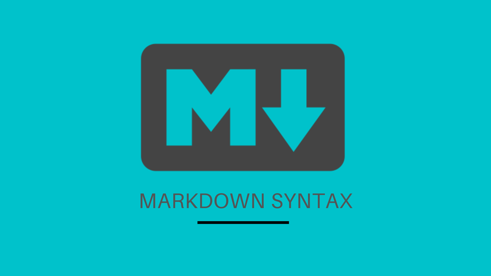

<p align="center">

</p>

# Markdown Syntax Guide


**`Markdown`** is a lightweight markup language used for formatting text. The common way we use markdown is in github Readme.md files. It can also be used  in github gists and comments in issues and pull requests.

Therefore, this guide will be focused on the various syntax that can be used when working with github.  

## **`Syntax Guide`**

- Headings
- Emphasis
- Lists
- Images
- Links
- Blockquote
- Horizontal Rule
- Code snippets
- Button
- Tables
- Task List
- Username @mentions
- Issue References
- Emoji

---

## `Headings`

_For headings, you add a space before the text._

``` shell
   # Heading 1 <h1>
   ## Heading 2 <h2>
   ### Heading 3 <h3>
   #### Heading 4 <h4>
   ##### Heading 5 <h5>
   ###### Heading 6 <h6>
```
   # Heading 1
   ## Heading 2 <h2>
   ### Heading 3 <h3>
   #### Heading 4 <h4>
   ##### Heading 5 <h5>
   ###### Heading 6 <h6>

---

## `Emphasis`
Italicised text can be written with an underscore or asterix before and after the text.

``` shell
_Italicise this text_

*Italicise this text*
```
---

## `Bold`
Bold text can be written with a double underscore or double asterix before and after the text.

``` shell
__Make this text bold__

**Make this text bold**
```
---

## `Lists`

Lists comprises of ordered and unordered.

**Ordered**

``` shell
1. List 1
2. List 2
3. List 3
```

**Unordered**

``` shell
- List 1
- List 2
- List 3
```
*Which translates to;*
- List 1
- List 2
- List 3

_Note: For Lists, add a space before the text_

---

## `Images`

``` shell

```


**We can also add gifs** 


---

## `Blockquote`

``` shell
> blockquote
```

> This is a block quote!

---

## `Horizontal rule`

``` shell
---
```
---

## `Links`

``` shell
[Title](Link url)
```
---

## `Code snippets`

``` shell
`code`

```

---

## `Button`

[](https://giphy.com/search/github)
---

## `Tables`

``` shell
| Header 1 | Header 2 | Header 3 |
---------| ---------| --------
| Content 1 | Content 2| Content 3 |
| Content 1 | Content 2| Content 3 |
| Content 1 | Content 2| Content 3 |
```
 
| Header 1 | Header 2 | Header 3 |
---------| ---------| --------
| Content 1 | Content 2| Content 3 |
| Content 1 | Content 2| Content 3 |
| Content 1 | Content 2| Content 3 |

---

## `Task List`

A task list comes in handy when you need to indicate progress in your issue list. This also works in pull requests.

``` shell
- [x] Indicates a complete task

- [ ] Indicates an incomplete task

```

- [x] Indicates a complete task

- [ ] Indicates an incomplete task

---

## `Username @mentions`

---

## `Issue references`


---

## `Emoji`


``` shell
:raised_hands: :metal: :family:
:wave: :smirk:
```

:raised_hands: :metal: :family:
:wave: :smirk:

[Webfx.com](https://www.webfx.com/tools/emoji-cheat-sheet/)

---

## `References`


